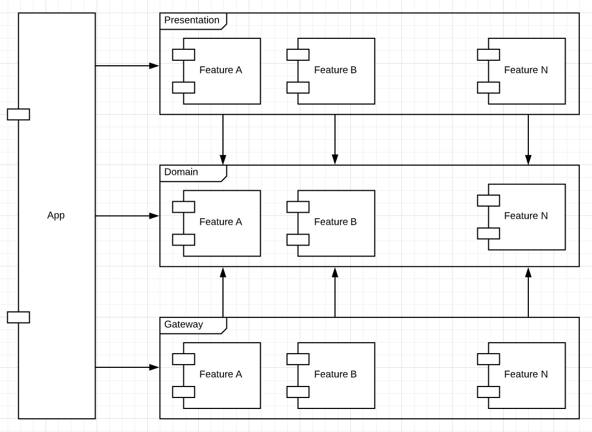

# Template for a Multi Modules Android Project
Template of an Android project implemented following Clean Architecture and Google's coding recommendations.

[](https://circleci.com/gh/matiasdelbel/android-zygote-multi-modules)

## Set Up
- Find and replace all the TODO in the project. They are related to the package id of the main module.
- To add a new feature on the project, run the `module-creator.jar`. Below there is an explanation about how to use it.

## Continue Integration
This project has configured [Circle CI](https://circleci.com/) as its continuous integration server.
When a build starts on the server (it can be triggered because of a PR or a commit into a remote branch),the CI runs the project's test
suite and create a coverage report. The coverage report is created using Jacoco and [CodeCov](https://codecov.io/).

To customize the build process on the CI, edit the file `.circleci/config.yml`.
Please notice, that this configuration is for **public projects**.
Private repositories will need to edit the `config.yml` file to supply tokens to both tools, Circle CI and CodeCov.

## Architecture
There is no restriction regarding the way you design your application. But, we strongly recommend the use of **Clean Architecture**.

It is not an objective of this Readme to explain Clean Architecture.
There are a lot of good articles on the [web](https://blog.cleancoder.com/uncle-bob/2012/08/13/the-clean-architecture.html) about it.
The key thing that you need to know about Clean is that you have to divide the software into independent layers.

- **Domain:** here is were your business objects live. Also, in this layer are defined the use cases.
The use cases specify how the different actors interact with your application.
- **Presentation:** this layer is in charge of managing the way you render the domain logic to the user. Here live fragments and activities.
- **Gateway:** or data. This layer is in charge of communication with other systems. Here you will find the repositories and sensor managers.





## Feature Creation
[module-creator](https://github.com/matiasdelbel/zygote-module-creation) tool is the best way of adding new features.
A jar file has already been add to this repository. To use it, execute the following command in the **root** of the project:

```
java -jar module-creator.jar
```

This tool create three modules per feature: `domain`, `presentation` and `gateway`.Presentation and gateway
depends on domain. It is also update your `settings.gradle.kts` to register those modules.